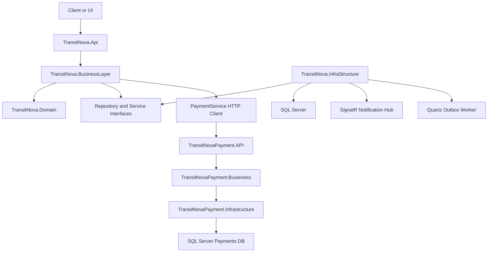

# TransitNova Backend

TransitNova is a modular logistics and shipment-management backend built with ASP.NET Core, Entity Framework Core, MediatR, CQRS, SQL Server, SignalR, Quartz, and Docker. The system models a full delivery workflow across users, carriers, operation managers, warehouse managers, administrators, shipments, trips, warehouses, subscriptions, notifications, and a separate simulated payment service.

The backend is designed as a learning-focused but production-shaped system: it uses layered architecture, domain entities with business behavior, command/query separation, validation pipelines, transaction handling, idempotency, cache invalidation, authorization policies, refresh-token rotation, outbox-based domain event publishing, health checks, structured logging, OpenTelemetry tracing, and integration tests for the public API surface.

## Repository Layout

```text
TransitNova/
  Src/
    TransitNova.Api/                Main HTTP API
    TransitNova.BusinessLayer/      Application layer, CQRS, DTOs, validators, services
    TransitNova.Domain/             Domain entities, enums, domain exceptions, domain events
    TransitNova.InfraStructure/     EF Core, Identity, repositories, SignalR, outbox, background jobs
  TransitNovaPayment/
    TransitNovaPayment.API/         Simulated payment gateway API
    TransitNovaPayment.Busieness/   Payment CQRS, validation, payment process logic
    TransitNovaPayment.Infrastructure/
  Tests/
    TransitNova.Api.IntegrationTests/
    TransitNova.ApplicationLayer.UnitTest/
    TransitNova.Domain.Tests/
    TransitNova.InfraStructure.UnitTest/
    TransitNova.MappingTests/
    TransitNova.Payment.Tests/
  UI/                               MVC/UI projects
  docker-compose.yml
  TransitNova.slnx
```

## Main Capabilities

- User authentication with ASP.NET Core Identity, JWT access tokens, refresh-token rotation, and role-based authorization.
- Role-specific workflows for users, carriers, operation managers, warehouse managers, and admins.
- Shipment creation, pricing, approval, rejection, cancellation, issuing, tracking, assignment, pickup, warehouse handoff, and delivery.
- Carrier profile management, vehicle management, trips, shipment completion, and carrier ratings.
- Warehouse, warehouse manager, city, government, country, zone, bundle, subscription, and role management.
- Payment workflow through a separate payment service using an HTTP gateway call and `X-PaymentKey`.
- Notifications persisted in the database and broadcast through SignalR.
- Domain events converted to outbox messages, then processed by a Quartz background job.
- API versioning, OpenAPI/Scalar documentation, health checks, rate limiting, CORS, structured logging, and distributed tracing.

## Architecture

TransitNova follows a layered backend architecture:



### Layer Responsibilities

| Layer | Responsibility |
| --- | --- |
| `TransitNova.Api` | HTTP endpoints, API versioning, request binding, authorization policies, middleware, OpenAPI, rate limits, health checks |
| `TransitNova.BusinessLayer` | CQRS commands and queries, handlers, DTOs, validators, application services, pipeline behaviors, cache contracts |
| `TransitNova.Domain` | Entities, aggregate behavior, domain events, domain exceptions, enums, invariants |
| `TransitNova.InfraStructure` | EF Core DbContext, Identity, repositories, unit of work, token generation, outbox, SignalR, Quartz, health checks |
| `TransitNovaPayment.API` | Payment gateway HTTP API |
| `TransitNovaPayment.Busieness` | Payment command/query handling, validation, payment method strategies |
| `TransitNovaPayment.Infrastructure` | Payment DbContext, repositories, cache, health checks |

## CQRS and Pipeline Behaviors

Application behavior is centralized through MediatR pipelines registered in `TransitNova.BusinessLayer.DependencyInjection`:

1. `ValidationBehavior`
2. `CachingBehavior`
3. `CacheInvalidationBehavior`
4. `TransactionPipelineBehavior`
5. `IdempotentCommandPipelineBehavior`

This means commands are validated before execution, cacheable queries can short-circuit from cache, cache invalidation happens after the inner command flow completes, transactional commands run inside a unit-of-work transaction, and idempotent commands persist a serialized response against the idempotency key.

Idempotent commands inherit from:

```csharp
public abstract record IdempotentCommand<TResponse>(Guid RequestId)
    : ICommand<TResponse>, ITransactional;
```

State-changing endpoints use the `X-Idempotency-Key` header through the custom `[IdempotencyKey]` model binding contract.

## Domain Model

The domain layer keeps important behavior inside entities instead of treating entities as simple data bags. Examples:

- `Shipment.Create(...)` creates a pending shipment, creates its first status history entry, generates a tracking number, and raises `ShipmentCreatedDomainEvent`.
- Shipment state transitions are controlled through methods such as `ApproveShipment`, `RejectShipment`, `CancelShipment`, `AssignToCarrier`, `DeliveredToWarehouse`, and `Delivered`.
- Domain exceptions describe invalid business transitions, capacity problems, duplicated trip assignments, invalid refresh tokens, and entity-not-found cases.
- Aggregates raise domain events through `AggregateRoot<TKey>`.

## Outbox and Domain Events

Domain events are stored through a transactional outbox:

1. Domain entities raise events.
2. `ConvertDomainEventsToOutboxMessages` intercepts `SaveChanges`.
3. Domain events are serialized into `OutboxMessages`.
4. Quartz runs `ProcessOutboxMessagesJob`.
5. Messages are deserialized and published through MediatR.
6. Handlers create notifications and other side effects.
7. Successfully processed messages are marked with `ProcessedOn`.

This avoids publishing side effects before the database transaction is saved.

## Authentication and Authorization

TransitNova uses JWT bearer authentication with ASP.NET Core Identity. Tokens include:

- User id
- Email
- User name
- Mobile phone
- User type
- JWT id
- Roles
- Permission claims derived from roles

Authorization is handled with:

- Role-based attributes such as `Role.User`, `Role.Admin`, and `Role.AllUsers`.
- Permission policies from `UserPermissions`, `CarrierPermissions`, `OperationManagerPermissions`, `WarehouseManagerPermissions`, and `AdminPermissions`.
- Resource-based authorization handlers:
  - `ShipmentOwnerHandler`
  - `CarrierOwnerHandler`
  - `CompletedProfileHandler`
  - `RefreshTokenAuthenticationHandler`
  - `TokenOwnerHandler`
  - `IsWarehouseManagerRequirementHandler`

## Refresh Token Flow

The refresh-token workflow rotates refresh tokens:

1. The existing refresh token is loaded.
2. The token is rejected if missing, expired, orphaned, or already revoked.
3. Reuse of a revoked token revokes all user tokens and throws `ReusedRefreshTokenException`.
4. The old token is revoked and linked to the replacement token.
5. A new refresh token is persisted.
6. User roles are loaded.
7. A new JWT access token is generated.

The current API endpoint is protected and checks token ownership through the authenticated principal and the supplied refresh token.

## Payment Service Integration

TransitNova has a separate payment service under `TransitNovaPayment/`. The main API calls it through `PaymentService` using:

- `PaymentSettings:BaseUrl`
- `PaymentSettings:PublicKey`
- `X-PaymentKey` header
- `POST /api/v1/payments/pay`

The payment service validates the incoming key against its private payment settings and returns a result envelope containing payment status, commission, total amount, paid timestamp, and notes.

## Observability

The backend includes:

- Serilog structured logging.
- Seq sink configuration.
- OpenTelemetry tracing.
- ASP.NET Core instrumentation.
- HttpClient instrumentation.
- Correlation id middleware.
- Health checks for API, database, payment configuration, and observability configuration.

When using Docker Compose, Seq is exposed on:

```text
http://localhost:8081
```

## API Documentation

The main API registers OpenAPI and Scalar in development.

Default Docker endpoints:

| Service | URL |
| --- | --- |
| Main API | `http://localhost:5200` |
| Payment API | `http://localhost:5300` |
| UI | `http://localhost:5169` |
| Seq | `http://localhost:8081` |

Scalar/OpenAPI is mapped when `ASPNETCORE_ENVIRONMENT=Development`.

## Configuration

Important environment variables:

| Variable | Description |
| --- | --- |
| `SQL_PASSWORD` | SQL Server SA password used by Docker Compose |
| `ConnectionStrings__ApiDefaultConnection` | Main API SQL Server connection string |
| `ConnectionStrings__PaymentDefaultConnection` | Payment SQL Server connection string |
| `JWT__Key` | JWT signing key. Must be at least 48 UTF-8 bytes for HS384 |
| `PaymentSettings__BaseUrl` | Base URL of the payment service, for example `http://transitnova-payment:80` |
| `PaymentSettings__PublicKey` | Key used by main API when calling payment service |
| `PaymentSettings__PrivateKey` | Key expected by payment service |

Example local `.env` values for Docker Compose:

```env
SQL_PASSWORD=Your_strong_password_123!
JWT_KEY=your-very-long-hs384-development-signing-key-at-least-48-bytes
PaymentSettings__PublicKey=dev-payment-key
PaymentSettings__PrivateKey=dev-payment-key
ConnectionStrings__ApiDefaultConnection=Server=sqlserver;Database=TransitNovaDb;User Id=sa;Password=Your_strong_password_123!;TrustServerCertificate=True
ConnectionStrings__PaymentDefaultConnection=Server=sqlserver;Database=PaymentsDb;User Id=sa;Password=Your_strong_password_123!;TrustServerCertificate=True
```

## Running Locally

### Run with Docker Compose

```bash
docker compose up --build
```

This starts:

- SQL Server
- Main API
- Payment API
- UI
- Seq

### Run Tests

```bash
dotnet test TransitNova.slnx --no-restore
```

Current verified test result on June 30, 2026:

```text
Failed: 0
Passed: 719
Skipped: 0
```

### Check Vulnerable Packages

```bash
dotnet list TransitNova.slnx package --vulnerable --include-transitive
```

Current scan result on June 30, 2026: no vulnerable packages reported by the configured NuGet sources.

## Test Strategy

The test suite covers:

- Domain entity behavior and domain exceptions.
- Application validators and command/query handlers.
- Pipeline behaviors.
- Payment workflow mapping and gateway failure handling.
- EF Core repository behavior using SQLite test infrastructure.
- Entity configurations.
- Outbox conversion and processing behavior.
- AutoMapper configuration.
- API endpoint discovery, endpoint execution through the HTTP pipeline, anonymous/protected endpoint behavior, idempotency header contracts, rate calculation endpoint behavior, and health endpoint behavior.

The API integration tests include an endpoint catalog checksum, which makes public API surface changes explicit.

## Engineering Notes

The backend is already beyond a basic CRUD junior project. The strongest parts are the CQRS structure, domain behavior, tests, outbox pattern, endpoint catalog tests, authorization policies, and operational concerns such as logging, tracing, health checks, Docker, and package vulnerability scanning.

Recommended next backend improvements before a serious production-style demo:

- Revisit refresh-token endpoint design so users can refresh after access-token expiry.
- Add concurrency tests for duplicate idempotency keys.
- Remove nullable warnings and consider enabling warnings-as-errors later.
- Add payment service endpoint integration tests that call the real payment API route.
- Dispose or reset unit-of-work transactions after commit/rollback.
- Move repetitive system-log/cache-invalidation behavior toward domain events or application policies as the project grows.

## License

No license file is currently included. Add one before publishing the repository publicly if the project is intended for reuse.
