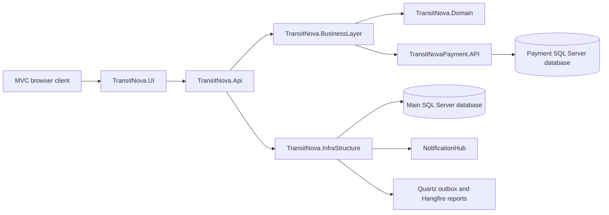

# TransitNova

TransitNova is a portfolio-grade logistics SaaS built with ASP.NET Core, Clean Architecture, CQRS, MediatR, EF Core, ASP.NET Core Identity, SignalR, and a separate mocked payment service. It models the operational lifecycle of shipments across customers, administrators, carriers, operation managers, and warehouse managers.

This repository is a complete controlled MVP and a strong fresh-graduate CV project. It is not presented as production-approved software; the engineering review documents the remaining concurrency, token-security, migration, indexing, and browser-testing work.

## Verified Baseline

Audited on 2026-07-13:

| Check | Result |
| --- | --- |
| Release solution build | Passed with `-m:1` |
| Automated tests | 862 non-browser tests passed, 0 failed, 0 skipped; 55 full-stack E2E cases authored (81.25% workflow coverage) |
| OpenAPI contract | 121 paths, 142 operations |
| Docker Compose syntax | Valid |
| AutoMapper configuration and SQL projections | Passed |
| Domain line coverage | 88.04% |
| Application line coverage | 81.24% |
| Infrastructure line coverage | 80.14% |
| Main API line coverage | 85.62% |
| Payment aggregate line coverage | 87.40% |

Overall line coverage is 82.31%. CI enforces an 80% line gate for every measured layer and overall; branch floors remain incremental improvement gates. See the [test coverage review](docs/TEST_COVERAGE_REVIEW.md).

## Capabilities

- Identity, JWT authentication, refresh-token rotation, role permissions, and resource ownership.
- Five role dashboards: User, Admin, Carrier, Operation Manager, and Warehouse Manager.
- Shipment creation, pricing, mocked payment, invoice, tracking, update, cancellation, review, rejection, assignment, pickup, warehouse handoff, delivery, issue, deletion, and rating.
- Trip planning, carrier and warehouse scoping, start, completion, cancellation, and shipment assignment.
- Carrier profile completion, vehicles, availability, workload, revenue, and ratings.
- Bundle subscriptions with eligibility checks, monthly benefit limits, shipping discounts, and invoice audit snapshots.
- Shared authenticated notifications with SignalR live delivery, unread count, read-all, paging, and role-specific MVC views.
- Admin management for users, roles, carriers, operation managers, warehouses, locations, bundles, subscriptions, shipments, trips, payments, and reports.
- Warehouse-scoped shipment and trip workflows.
- PDF report generation through Hangfire and QuestPDF.
- Durable domain-event outbox processing through Quartz.
- Health checks, Serilog, Seq, correlation IDs, OpenTelemetry, Swagger, Scalar, and OpenAPI snapshots.

## Architecture



| Project | Responsibility |
| --- | --- |
| `TransitNova.Domain` | Aggregates, entities, value objects, enums, events, invariants |
| `TransitNova.BusinessLayer` | CQRS, handlers, validators, DTOs, services, pipeline behaviors |
| `TransitNova.InfraStructure` | EF Core, Identity, repositories, tokens, caching, jobs, SignalR, reports |
| `TransitNova.Api` | Versioned HTTP endpoints, authorization, rate limiting, errors, OpenAPI |
| `TransitNovaUI.BusinessLayer` | Typed API clients and UI contracts |
| `TransitNova.UI` | MVC Areas, Razor dashboards, forms, and JavaScript workflows |
| `TransitNovaPayment` | Independent payment simulation and payment persistence |

Read the complete [architecture description](docs/ARCHITECTURE.md) and [architecture review](docs/ARCHITECTURE_REVIEW.md).

## Repository Layout

```text
TransitNova/
  Src/
    TransitNova.Api/
    TransitNova.BusinessLayer/
    TransitNova.Domain/
    TransitNova.InfraStructure/
  UI/
    TransitNova.UI/
    TransitNovaUI.BusinessLayer/
  TransitNovaPayment/
    TransitNovaPayment.API/
    TransitNovaPayment.Busieness/
    TransitNovaPayment.Infrastructure/
  Tests/
    TransitNova.Api.IntegrationTests/
    TransitNova.ApplicationLayer.UnitTest/
    TransitNova.Domain.Tests/
    TransitNova.InfraStructure.UnitTest/
    TransitNova.MappingTests/
    TransitNova.Payment.Tests/
    TransitNova.E2E.Tests/
  build/coverage/
  docs/
  .github/workflows/ci.yml
  docker-compose.yml
  TransitNova.slnx
```

## Requirements

- .NET SDK 10.x.
- Docker Desktop for the complete local topology.
- PowerShell.
- EF Core CLI 10.0.9 for migration generation against the audited package version.

## Local Configuration

Create an untracked `.env` file in the repository root:

```dotenv
SQL_PASSWORD=<strong-local-sql-password>
JWT_KEY=<at-least-48-bytes-of-random-development-key-material>
PaymentSettings__PublicKey=<local-payment-public-key>
PaymentSettings__PrivateKey=<matching-local-payment-private-key>
ConnectionStrings__ApiDefaultConnection=Server=sqlserver,1433;Database=TransitNovaDb;User Id=sa;TrustServerCertificate=True
ConnectionStrings__PaymentDefaultConnection=Server=sqlserver,1433;Database=TransitNovaPaymentDb;User Id=sa;TrustServerCertificate=True
```

Set `SeedDemoData=false` unless deterministic portfolio demo accounts and records are intentionally required.

When `SeedDemoData=true`, TransitNova expects real lookup location data to already exist in the main database. Add `Countries`, `Governments`, and `Cities` first; the demo seeder intentionally does not fake geography.

All seeded demo accounts share one password: `TransitNova@12345`.

| User type | Email pattern | Example |
| --- | --- | --- |
| User | `customer.NNN@seed.transitnova.local` | `customer.001@seed.transitnova.local` |
| Admin | `admin.NNN@seed.transitnova.local` | `admin.001@seed.transitnova.local` |
| Carrier | `carrier.NNN@seed.transitnova.local` | `carrier.001@seed.transitnova.local` |
| Operation Manager | `operation.manager.NNN@seed.transitnova.local` | `operation.manager.001@seed.transitnova.local` |
| Warehouse Manager | `warehouse.manager.NNN@seed.transitnova.local` | `warehouse.manager.001@seed.transitnova.local` |

## Run with Docker

```powershell
docker compose config --quiet
docker compose up --build
```

| Service | URL |
| --- | --- |
| MVC UI | `http://localhost:5169` |
| Main API | `http://localhost:5200` |
| Payment API | `http://localhost:5300` |
| Main health | `http://localhost:5200/health` |
| Payment health | `http://localhost:5300/health` |
| SignalR notifications | `http://localhost:5200/hubs/notifications` |
| Seq | `http://localhost:8081` |

The Compose topology is for local Development only. See [deployment guidance](docs/DEPLOYMENT.md) before using another environment.

## Database Migrations

Main database migration:

```powershell
dotnet ef database update `
  --project Src/TransitNova.InfraStructure/TransitNova.InfraStructure.csproj `
  --startup-project Src/TransitNova.Api/TransitNova.Api.csproj `
  --context AppDbContext
```

Payment database migration:

```powershell
dotnet ef database update `
  --project TransitNovaPayment/TransitNovaPayment.Infrastructure/TransitNovaPayment.Infrastructure.csproj `
  --startup-project TransitNovaPayment/TransitNovaPayment.API/TransitNovaPayment.API.csproj `
  --context AppDbContext
```

Current migrations:

- Main: `20260712073348_InitialMigration`, `20260713023105_AddShipmentInvoiceSubscriptionBenefitAudit`
- Payment: `20260712073648_InitialMigration`

## Build and Test

```powershell
dotnet restore TransitNova.slnx
dotnet build TransitNova.slnx --configuration Release --no-restore -m:1
dotnet test TransitNova.slnx --configuration Release --no-build
```

GitHub Actions is defined in [`.github/workflows/ci.yml`](.github/workflows/ci.yml). It merges coverage from all six non-browser suites, enforces 80% line coverage per layer and overall, runs a separate Compose-backed browser/API E2E job, and uploads coverage, TRX, E2E, and service-log artifacts.

## Documentation

- [Engineering documentation index](docs/README.md)
- [Project review and scorecard](docs/PROJECT_REVIEW.md)
- [Architecture](docs/ARCHITECTURE.md)
- [Architecture review](docs/ARCHITECTURE_REVIEW.md)
- [Code quality review](docs/CODE_QUALITY_REVIEW.md)
- [Performance review](docs/PERFORMANCE_REVIEW.md)
- [Security review](docs/SECURITY_REVIEW.md)
- [Test coverage review](docs/TEST_COVERAGE_REVIEW.md)
- [Database design](docs/DATABASE_DESIGN.md)
- [API design](docs/API_DESIGN.md)
- [Deployment runbook](docs/DEPLOYMENT.md)
- [Development guide](docs/DEVELOPMENT_GUIDE.md)

## Honest Readiness

| Context | Score |
| --- | ---: |
| Fresh-graduate CV project | 8.8/10 |
| Controlled portfolio MVP | 8.1/10 |
| Production readiness today | 6.3/10 |
| Overall engineering review | 7.4/10 |

Highest-priority production work:

1. Remove concurrent EF Core operations on the same scoped context in dashboard builders.
2. Hash refresh tokens at rest and remove token values from logs.
3. Add Warehouse Manager permissions to generated JWT claims.
4. Unify deployment-time migration handling for Main and Payment databases.
5. Add Notification and Outbox indexes.
6. Complete the remaining payment, SignalR, report, and idempotency browser workflows and add SQL Server Testcontainers.

The full rationale and prioritized plan are in [PROJECT_REVIEW.md](docs/PROJECT_REVIEW.md).

## License

No license file is currently included. Add an explicit license before allowing public reuse.
