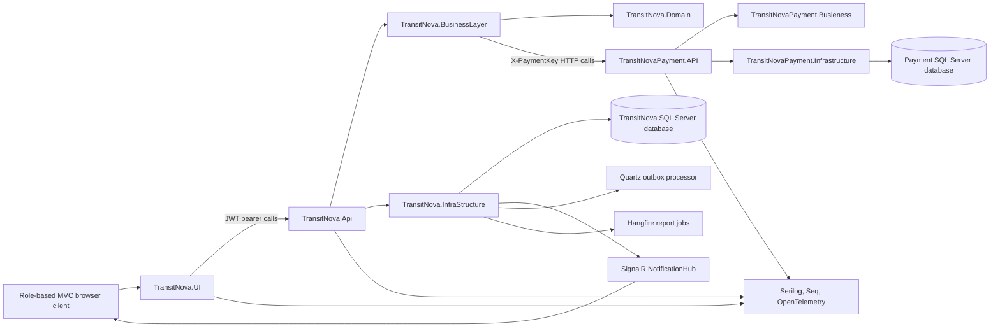

# TransitNova Architecture

## Purpose

Describe the implemented architecture, runtime boundaries, dependency flow, and principal business workflows without evaluating them. Architecture judgments are kept in [ARCHITECTURE_REVIEW.md](ARCHITECTURE_REVIEW.md).

## Scope

The document covers the main logistics API, MVC UI, payment service, SQL Server databases, background processing, real-time notifications, reports, and test projects in `TransitNova.slnx`.

## System Context



## Project Boundaries

| Project | Implemented responsibility | Direct project dependencies |
| --- | --- | --- |
| `TransitNova.Domain` | Aggregates, entities, value objects, enums, permissions, domain events, domain exceptions | No project references; package references to MediatR and NUlid |
| `TransitNova.BusinessLayer` | CQRS contracts, handlers, validators, DTOs, result pattern, pipeline behaviors, application services | Domain |
| `TransitNova.InfraStructure` | EF Core, Identity, repositories, unit of work, JWT generation, SignalR, caching, outbox, Quartz, Hangfire, reports, health checks | BusinessLayer, Domain |
| `TransitNova.Api` | Versioned HTTP endpoints, authorization handlers, rate limiting, ProblemDetails, OpenAPI, middleware | BusinessLayer, InfraStructure |
| `TransitNovaUI.BusinessLayer` | Typed API clients, UI DTOs, route construction, API response deserialization | BusinessLayer |
| `TransitNova.UI` | ASP.NET Core MVC Areas, cookie session, role dashboards, Razor views, JavaScript workflows | UI BusinessLayer |
| `TransitNovaPayment.Busieness` | Payment commands, handlers, validation, payment simulation, payment result contract | No project references |
| `TransitNovaPayment.Infrastructure` | Payment EF Core context, repositories, cache, health checks | Payment Business |
| `TransitNovaPayment.API` | Payment HTTP endpoints, rate limiting, ProblemDetails, telemetry | Payment Business, Payment Infrastructure |

The repository contains approximately 1,455 non-generated C# files across product and test code. The main product includes 49 API controllers, 46 MVC controllers, 154 Razor views, 131 MediatR handlers, 98 validators, 28 domain entity files, and 23 explicit EF Core entity configurations.

## Main API Request Flow

1. `TransitNova.Api` authenticates the JWT using issuer, audience, lifetime, signing-key validation, and zero clock skew in `AuthenticationRegistrationExtensions.cs`.
2. Controller attributes apply role, permission, resource-ownership, and rate-limit requirements.
3. A controller creates a command or query and sends it through MediatR.
4. Pipeline behaviors run validation, caching, cache invalidation, transactions, and idempotency according to request marker interfaces.
5. A handler coordinates domain behavior and repository contracts.
6. Infrastructure repositories execute EF Core queries or persist aggregate changes.
7. The result pattern is converted to an HTTP envelope by `ResultExtensions.cs`; unhandled exceptions are converted to ProblemDetails by `GlobalExceptionHandler.cs`.
8. The MVC client deserializes the response through `HttpHandler.cs`, including envelope, empty-body, validation, and ProblemDetails paths.

## Shipment Creation and Subscription Benefit Flow

```mermaid
sequenceDiagram
    participant User as User MVC Area
    participant Api as Main API
    participant Handler as CreateShipment Handler
    participant Benefit as BundleBenefitService
    participant Pay as Payment API
    participant Db as Main Database
    participant Outbox as Outbox Processor
    participant Hub as SignalR Hub

    User->>Api: POST /api/v1/users/shipments
    Api->>Handler: CreateShipmentCommand
    Handler->>Benefit: Evaluate active subscription and limits
    Benefit-->>Handler: Original cost, discount, final cost
    Handler->>Pay: Simulated payment request using final cost
    Pay-->>Handler: Payment result
    alt payment succeeds
        Handler->>Db: Persist shipment and invoice audit snapshot
        Db->>Db: Save aggregate event as OutboxMessage
        Handler-->>User: Invoice response with hidden ShipmentId link data
        Outbox->>Hub: Publish user-scoped notification
    else payment fails
        Handler-->>User: Failure result; no successful invoice response
    end
```

The invoice stores the original shipping cost, discount percentage and amount, final shipping cost, bundle identifiers, bundle name, and an applied flag. Distance eligibility is not enforced because the shipment creation contract does not currently carry a route-distance value.

## Notification Flow

Domain event handlers create `Notification` records for a specific `AppUser` identifier. `SignalRNotificationBroadcaster` sends the complete DTO to `Clients.User(userId.ToString())`. The authenticated `NotificationHub` is mapped at `/hubs/notifications`. Shared API endpoints list notifications, return unread count, and mark all notifications read based only on `User.GetUserId()`.

## Background Processing

- Quartz schedules `ProcessOutboxMessagesJob`. It reads up to 20 unprocessed messages, resolves the stored assembly-qualified event type, deserializes with Newtonsoft.Json, publishes through MediatR, and retries failures up to five times.
- Hangfire runs report generation and cleanup jobs backed by SQL Server storage.
- Report generation uses strategy selection and QuestPDF to produce dashboard, shipment, invoice, and bundle artifacts.

## Data Architecture

The main `AppDbContext` extends ASP.NET Core Identity's `IdentityDbContext<AppUser, IdentityRole<Guid>, Guid>`. It owns logistics, identity, notification, report, idempotency, refresh-token, and outbox tables. The payment service has an independent `AppDbContext` and migration history.

Queries generally use `AsNoTracking`, server-side projection, stable ordering, and pagination. Command repositories return tracked aggregates so domain methods enforce status transitions before `UnitOfWork.SaveChangesAsync` persists them. The unit of work converts `ISoftDeletable` deletes into updates and controls explicit transactions for requests marked `ITransactional`.

## Presentation Architecture

The MVC application has five authenticated role Areas: User, Admin, Carrier, Operation Manager, and Warehouse Manager, plus account/error surfaces. Each Area uses thin controllers and typed API clients. A shared SignalR script updates the notification badge and page. The User create-shipment page uses asynchronous form submission, inline validation, a payment overlay, and an invoice modal while preserving a non-JavaScript fallback.

## Configuration Sources

Configuration is loaded through standard ASP.NET Core providers. Docker Compose injects database connection strings, JWT signing key, payment keys, service URLs, and OTLP endpoints. Options validation fails startup when required JWT or payment settings are missing. `.env` is present locally but is not tracked by Git.

## Runtime Ports

| Component | Host port | Container port |
| --- | ---: | ---: |
| MVC UI | 5169 | 80 |
| Main API | 5200 | 80 |
| Payment API | 5300 | 80 |
| SQL Server | 1433 | 1433 |
| Seq UI | 8081 | 80 |
| Seq OTLP ingestion | 5341 | 5341 |

## Architecture Change Rules

- Public endpoints must return DTOs or response contracts, never tracked EF entities.
- New commands must declare their transaction, idempotency, and cache-invalidation behavior explicitly.
- User-scoped queries must derive ownership from authenticated claims or enforce a resource authorization policy before accepting route identifiers.
- Domain events that require durable side effects must be persisted through the outbox in the same save operation as the aggregate.
- A migration, OpenAPI snapshot update, and relevant tests must accompany data-contract changes.
