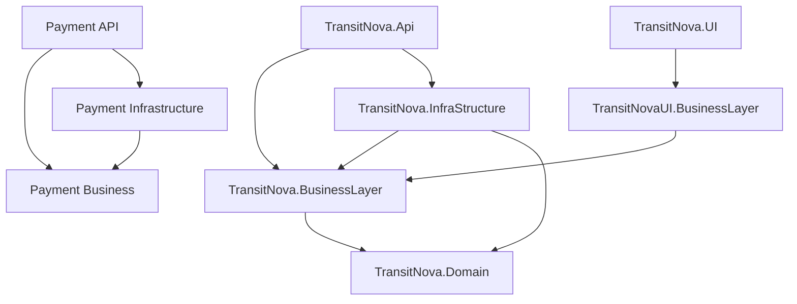

# Architecture Review

## Purpose

Evaluate the implemented architecture decisions, their benefits, drawbacks, alternatives, and production consequences.

## Scope

Clean Architecture boundaries, CQRS/MediatR, dependency injection, result handling, repositories, transactions, validation, idempotency, caching, background jobs, outbox processing, logging, exception handling, and configuration.

## Executive Summary

The main logistics application follows a recognizable Clean Architecture and CQRS design. Domain behavior is richer than an anemic model, handlers depend on interfaces, infrastructure owns EF Core and external adapters, and controllers are generally thin. Cross-cutting concerns are centralized in MediatR behaviors. The architecture is strong for a portfolio MVP.

The architecture is not fully isolated. `TransitNova.Domain` references MediatR, `TransitNovaUI.BusinessLayer` references the server BusinessLayer and Domain, and AutoMapper scans loaded assemblies at runtime. More importantly, dashboard application services run parallel operations through repositories backed by the same scoped `AppDbContext`, which violates EF Core's concurrency contract.

## Current Implementation

### Dependency Direction

The API composition root intentionally references Infrastructure. BusinessLayer does not reference Infrastructure. The UI client dependency on server BusinessLayer is the notable reverse-coupling concern because client deployment and contract versioning are no longer independent.

### MediatR Pipeline Order

`DependencyInjection.cs` registers Validation, Caching, CacheInvalidation, Transaction, and Idempotent command behaviors. MediatR executes behaviors in registration order around the handler. Marker interfaces decide which behavior applies.

## Engineering Analysis

| Decision | Why it works | Drawback | Preferred evolution |
| --- | --- | --- | --- |
| Domain-rich aggregates | State transitions and events stay close to Shipment, Trip, Carrier, Warehouse, and Bundle invariants | Some mutable entity properties still permit bypassing methods | Continue moving subscription invariants behind methods and private setters |
| CQRS with MediatR | 131 handlers keep endpoint orchestration focused and make validation/caching composable | Feature surface is fragmented across many small files; simple CRUD reads can feel over-abstracted | Keep CQRS for workflows; allow direct application query services for trivial read models when justified |
| Result pattern | Expected failures do not depend on exceptions and map to an explicit API envelope | Main API, UI client, and Payment service each define related but different result contracts | Publish a small transport-contract package or OpenAPI-generated client without sharing server application assemblies |
| Repository interfaces | BusinessLayer is isolated from EF Core and tests can mock collaborators | Very granular interfaces and generic repositories can hide query behavior and create indirection | Keep aggregate repositories; prefer purpose-built query interfaces over generic repositories |
| Unit of Work and transaction marker | Commands can opt into atomic multi-repository persistence | Explicit transactions must coordinate with idempotency and external payment calls; no retry execution strategy is enabled | Keep database transactions short and never include external HTTP waits; use outbox or sagas for cross-service consistency |
| FluentValidation behavior | Command validation is centralized and returns structured errors | Queries do not pass through the behavior, and global FluentValidation exceptions use a different status code | Validate query pagination/filter objects at model binding or add a query-validation marker |
| Idempotent command behavior | Request hash prevents key reuse with a different payload and persisted response supports replay | Serialized response schema is coupled to CLR type shape; cleanup and retention policy are not visible | Version response payloads and schedule expiration cleanup by `CreatedAt` |
| In-memory caching | Low operational cost and fast local reads | Not coherent across instances; a size limit of 130 is application-specific and cache-key invalidation is manual | Use distributed cache and versioned keys before horizontal scale |
| Outbox interceptor | Aggregate changes and event records are persisted in the same save operation | `AddDbContextFactory` is registered without the outbox interceptor, and multi-instance message claiming is absent | Apply the interceptor consistently and use atomic claim/update or a queue transport |
| Quartz outbox job | Bounded batch and retry count provide controlled processing | `[DisallowConcurrentExecution]` protects one scheduler, not multiple application instances | Add database leasing and dead-letter visibility |
| Hangfire reports | Durable job storage suits long-running PDF generation | Two schedulers increase operational and diagnostic surface | Keep Quartz for integration events and Hangfire for user jobs, with documented queues and dashboards |
| ProblemDetails plus result envelopes | Handles expected and unexpected failures and is consumable by `HttpHandler` | Status and body shapes are not fully consistent, and exception messages are used as public titles | Define one error-contract policy and test every status mapping |
| Startup options validation | Missing JWT and payment settings fail early | Main and Payment startup migration behavior differs; MVC host is not validated | Add typed options for all cross-service URLs and a deployment readiness check |

## Strengths

- BusinessLayer has no EF Core dependency and Infrastructure owns persistence concerns.
- Domain methods raise events at meaningful state transitions.
- The outbox interceptor clears events only after creating durable records in the change tracker.
- Transaction behavior rolls back failed results as well as thrown exceptions.
- Idempotency verifies both request ID and payload hash.
- Resource authorization is used for shipment, carrier, refresh-token, and warehouse ownership cases.
- DTO projection keeps public JSON independent from tracked entity navigation graphs.
- Background report generation is separated through strategy and repository contracts.

## Weaknesses

### Concurrent EF Core Queries

`AdminDashboard.BuildAsync`, `CarrierDashboard.BuildAsync`, `OperationManagerDashboard.BuildAsync`, and `WarehouseManagerDashboardBuilder.BuildAsync` start multiple repository tasks and await `Task.WhenAll`. Their repositories are scoped and inject the same `AppDbContext`. This can throw `InvalidOperationException` when a second query starts before the first completes. Unit tests built with mocks do not reproduce the failure.

### Boundary Coupling

`TransitNovaUI.BusinessLayer.csproj` references `TransitNova.BusinessLayer.csproj`, and UI response code imports `TransitNova.Domain.Enums.Result`. This avoids duplicate DTO declarations but binds the UI client to server internals. A generated OpenAPI client or a dedicated Contracts project would preserve type sharing without exposing application dependencies.

### Domain Package Dependency

Domain references MediatR so domain events can participate directly in publication. This is pragmatic, but means the domain is not framework-independent. A local `IDomainEvent` abstraction already exists and could remove the direct package dependency if publication adapters handled conversion.

### Assembly Scanning

Business DI uses `config.AddMaps(AppDomain.CurrentDomain.GetAssemblies())`. Loaded assembly order varies by host and test environment. Explicit BusinessLayer and Infrastructure assemblies would make map discovery deterministic and avoid accidental profiles.

### Persistence Inconsistency

The scoped context includes `ConvertDomainEventsToOutboxMessages`; the registered context factory does not. Any future aggregate command that saves through the factory can persist state without its events.

## Risks

- Runtime dashboard crashes are likely under real EF Core execution until context concurrency is corrected.
- Idempotency response deserialization can fail after a response type is renamed or structurally changed.
- Process-local cache can return different values from different replicas.
- Multiple application replicas can process the same outbox message without a database claim.
- Automatic migration on main API startup can create a race between replicas and makes rollback less controlled.

## Trade-offs

The modular monolith is the correct default for this product size. Converting shipment, warehouse, identity, and notification features into separate services now would add distributed transactions and operational burden. The Payment boundary is sufficient to demonstrate external service integration. The immediate architecture work should improve consistency and boundaries inside the current topology rather than split it further.

## Metrics

| Metric | Value |
| --- | ---: |
| MediatR handlers | 131 |
| Validators | 98 |
| Explicit pipeline behaviors | 5 |
| API operations | 141 |
| Main EF Core contexts registered | Scoped context plus scoped factory |
| Background schedulers | 2: Quartz and Hangfire |

## Production Readiness

Architecture readiness is good for one controlled instance and a demo database. Multi-instance safety and client/server contract isolation need work before production.

## Recommendations

### High Priority

1. Remove same-context parallel EF queries. Use sequential awaits or one factory-created context per parallel query.
2. Make outbox processing atomically claim messages and expose dead-letter state after five failures.
3. Align Payment and Main migration ownership in an explicit deployment stage.
4. Add architecture tests that enforce allowed project references and forbid EF entities in controller response contracts.

### Medium Priority

1. Extract transport DTOs and result enums into a dedicated Contracts project or generate clients from OpenAPI.
2. Register AutoMapper profiles from explicit assemblies.
3. Apply the outbox interceptor to every context path that can save aggregates.
4. Define retention and cleanup for idempotency and processed outbox records.

### Low Priority

1. Remove MediatR from Domain through a local event abstraction.
2. Consolidate scheduler configuration and operational dashboards.

## Future Improvements

Introduce distributed caching, database-backed outbox leasing, deployment-time migrations, and dependency-rule tests before adding more service boundaries.

## Overall Score

**7.6/10**

## Final Verdict

The architecture is thoughtful and demonstrably implemented, not decorative. It is suitable for an MVP and a strong portfolio, but the EF concurrency and multi-instance consistency findings must be treated as release blockers.
